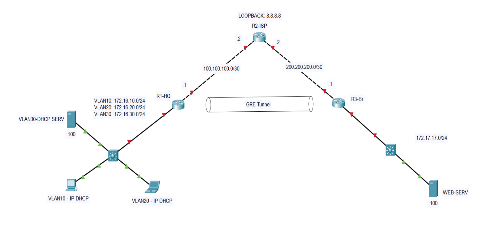

# Cisco Network Project: Headquarters & Branch Connectivity


## 📋 Project Overview
This repository contains my implementation of a university network project for **Computer Networks 2** course under Dr. Fatemeh Rezaei. The project simulates a real-world enterprise network with headquarters and branch office connected securely over the internet.


## 🏗 Network Architecture

### Network Components
| Device | Role | Location |
|--------|------|----------|
| R1-HQ | Main Router (Router-on-a-Stick) | Headquarters |
| R3-Branch | Branch Router | Branch Office |
| ISP Router | Internet Simulation | Cloud |
| HQ-Switch | Layer 2 Switch with VLANs | Headquarters |
| Branch-Switch | Branch Switch | Branch Office |
| DHCP Server | Centralized IP Allocation | HQ (VLAN 30) |
| Web Server | HTTPS Service | Branch (172.17.17.100) |

### IP Addressing Scheme
| Network | Subnet | VLAN | Gateway |
|---------|--------|------|---------|
| Users VLAN 10 | 172.16.10.0/24 | 10 | 172.16.10.1 |
| Users VLAN 20 | 172.16.20.0/24 | 20 | 172.16.20.1 |
| DHCP Server | 172.16.30.0/24 | 30 | 172.16.30.1 |
| Branch LAN | 172.17.17.0/24 | - | 172.17.17.1 |
| GRE Tunnel | 10.10.10.0/30 | - | - |
| WAN Links | 100.100.100.0/30, 200.200.200.0/30 | - | - |

## 🔧 Implemented Features

### ✅ Core Requirements
1. **VLAN Implementation** - Separated HQ network into VLAN 10, 20, and 30
2. **Router-on-a-Stick** - R1 configured with subinterfaces for inter-VLAN routing
3. **DHCP Service** - Central DHCP server assigns IPs to VLAN 10 & 20 clients
4. **NAT/PAT** - Enabled on R1 and R3 for internet access (ping 8.8.8.8)
5. **GRE Tunnel** - Site-to-site tunnel between R1 and R3
6. **OSPF Routing** - Dynamic routing over GRE tunnel

### ⭐ Bonus Features
7. **ACL Security** - Web server (172.17.17.100) accepts HTTPS only, blocks ICMP

## 📁 Repository Contents

### Configuration Files
- [R1-HQ Complete Configuration](Configs/R1-HQ_config.txt)
- [R3-Branch Complete Configuration](Configs/R3-Branch_config.txt)
- [HQ-Switch Configuration](Configs/HQ-Switch_config.txt)
- [DHCP Server Setup](Configs/DHCP_Server_Config.md)

### Step-by-Step Documentation
- [01 - VLAN Design and Trunking](Documentation/01-VLAN_Design.md)
- [02 - Router-on-a-Stick Implementation](Documentation/02-Router_on_Stick.md)
- [03 - NAT/PAT Configuration](Documentation/03-NAT_PAT_Configuration.md)
- [04 - DHCP Server and Relay](Documentation/04-DHCP_Configuration.md)
- [05 - GRE Tunnel Setup](Documentation/05-GRE_Tunnel_Setup.md)
- [06 - OSPF Dynamic Routing](Documentation/06-OSPF_Routing.md)
- [07 - ACL Security Configuration](Documentation/07-ACL_Security.md)
- [08 - Verification and Testing](Documentation/08-Verification_Tests.md)

## 📝 Key Configuration Highlights

### 1. VLAN Configuration on HQ-Switch
```cisco
vlan 10
 name Users_VLAN10
vlan 20
 name Users_VLAN20
vlan 30
 name DHCP_Server
!
interface f0/1
 switchport mode access
 switchport access vlan 10
!
interface f0/2
 switchport mode access
 switchport access vlan 20
!
interface g0/1
 switchport mode trunk
 switchport trunk allowed vlan 10,20,30
```

### 2. Router-on-a-Stick on R1-HQ
```cisco
interface GigabitEthernet0/1.10
 encapsulation dot1Q 10
 ip address 172.16.10.1 255.255.255.0
 ip helper-address 172.16.30.10
!
interface GigabitEthernet0/1.20
 encapsulation dot1Q 20
 ip address 172.16.20.1 255.255.255.0
 ip helper-address 172.16.30.10
```

### 3. NAT Configuration on R1-HQ
```cisco
interface GigabitEthernet0/0
 ip nat outside
!
interface GigabitEthernet0/1.10
 ip nat inside
!
access-list 1 permit 172.16.0.0 0.0.255.255
ip nat inside source list 1 interface GigabitEthernet0/0 overload
```

### 4. GRE Tunnel Configuration
```cisco
! On R1-HQ
interface Tunnel0
 ip address 10.10.10.1 255.255.255.252
 tunnel source GigabitEthernet0/0
 tunnel destination 200.200.200.2

! On R3-Branch
interface Tunnel0
 ip address 10.10.10.2 255.255.255.252
 tunnel source GigabitEthernet0/0
 tunnel destination 100.100.100.2
```

### 5. OSPF Configuration on R1-HQ
```cisco
router ospf 1
 router-id 1.1.1.1
 network 172.16.10.0 0.0.0.255 area 0
 network 172.16.20.0 0.0.0.255 area 0
 network 172.16.30.0 0.0.0.255 area 0
 network 10.10.10.0 0.0.0.3 area 0
 passive-interface GigabitEthernet0/1.10
 passive-interface GigabitEthernet0/1.20
 passive-interface GigabitEthernet0/1.30
```

### 6. ACL for Web Server Security on R3-Branch
```cisco
ip access-list extended WEB-SERVER-ACL
 deny icmp any host 172.17.17.100 echo
 permit tcp any host 172.17.17.100 eq 443
 permit ip any any
!
interface GigabitEthernet0/1
 ip access-group WEB-SERVER-ACL in
```

## 🚀 Quick Start

### Prerequisites
- Cisco Packet Tracer 7.3 or higher
- Basic understanding of networking concepts

### Getting Started
1. **Clone or download** this repository
2. **Open** `40119783-NetProject.pkt` in Packet Tracer
3. **Explore** the topology and test connectivity
4. **Review** configuration files in `Configs/` folder
5. **Read** step-by-step documentation in `Documentation/` folder

### Quick Tests
```bash
# From any PC (after DHCP):
ping 8.8.8.8              # Test internet access via NAT
ping 172.17.17.10         # Test HQ-to-Branch connectivity

# From HQ PC to web server:
ping 172.17.17.100        # Should FAIL (blocked by ACL)
https://172.17.17.100     # Should WORK (HTTPS allowed)
```

## 📖 Documentation

This project includes comprehensive documentation:

- **[USAGE.md](USAGE.md)** - How to use this repository
- **[GIT_GUIDE.md](GIT_GUIDE.md)** - Version control best practices
- **[Documentation/](Documentation/)** - Complete step-by-step guides

### Learning Path
1. [VLAN Design](Documentation/01-VLAN_Design.md) - Network segmentation
2. [Router-on-a-Stick](Documentation/02-Router_on_Stick.md) - Inter-VLAN routing
3. [NAT/PAT](Documentation/03-NAT_PAT_Configuration.md) - Internet access
4. [DHCP](Documentation/04-DHCP_Configuration.md) - Automatic IP assignment
5. [GRE Tunnel](Documentation/05-GRE_Tunnel_Setup.md) - Site-to-site connectivity
6. [OSPF](Documentation/06-OSPF_Routing.md) - Dynamic routing
7. [ACL Security](Documentation/07-ACL_Security.md) - Access control
8. [Testing](Documentation/08-Verification_Tests.md) - Comprehensive validation

## 🧪 Testing & Validation

All features have been tested and verified. See [Documentation/08-Verification_Tests.md](Documentation/08-Verification_Tests.md) for:
- ✅ Physical layer connectivity
- ✅ VLAN and trunk operation
- ✅ Inter-VLAN routing
- ✅ DHCP IP assignment
- ✅ NAT/PAT to internet  
- ✅ GRE tunnel connectivity
- ✅ OSPF neighbor adjacency
- ✅ ACL security rules
- ✅ End-to-end HQ-Branch communication

## 🎯 Project Requirements Met

| Requirement | Status | Description |
|-------------|--------|-------------|
| VLANs | ✅ | Three VLANs at HQ (10, 20, 30) |
| Router-on-Stick | ✅ | Subinterfaces for inter-VLAN routing |
| DHCP | ✅ | Central server with IP relay configured |
| NAT/PAT | ✅ | All networks can reach Internet (8.8.8.8) |
| GRE Tunnel | ✅ | Secure site-to-site connection |
| OSPF | ✅ | Dynamic routing over tunnel |
| **Bonus: ACL** | ⭐ | Web server security implemented |

## 💡 Key Learning Outcomes

Through this project, I gained hands-on experience with:
- **VLAN Design** - Network segmentation for security and performance
- **Routing Protocols** - OSPF dynamic routing and convergence
- **Network Services** - DHCP relay, NAT/PAT translation
- **Tunneling** - GRE encapsulation for site-to-site VPNs
- **Security** - ACL implementation for traffic filtering
- **Troubleshooting** - Systematic network problem-solving


## 📚 Additional Resources

- [Cisco Packet Tracer Download](https://www.netacad.com/courses/packet-tracer)
- [Cisco IOS Command Reference](https://www.cisco.com/c/en/us/support/)
- [CCNA Study Guide](https://www.cisco.com/c/en/us/training-events/training-certifications/certifications/associate/ccna.html)


## 📄 License & Attribution

**Academic Project** - For educational purposes  
**Course:** Computer Networks 2  
**Instructor:** Dr. Fatemeh Rezaei  
**Institution:** K. N. Toosi University of Technologey


---


*Last Updated: February 2026*
